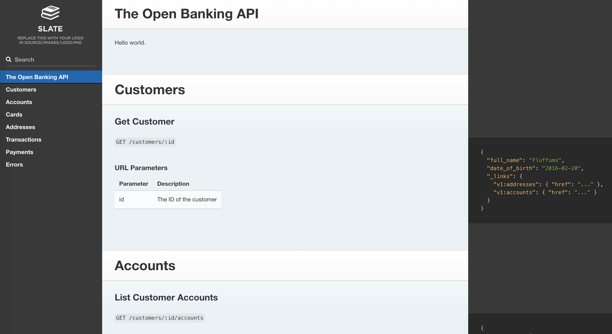

# Open Banking API



## Getting Set Up

### Build the image
```shell
docker build -t api-docs-local .
```

### Run the server
```shell
docker run -p 80:80 api-docs-local
```

### Run the server in dev (docs are re-rendered on file changes)
```shell
docker run -p 80:80 -v $(pwd):/srv/www api-docs-local bundle exec middleman server -p 80 --force-polling
```

## Making changes to the docs
The file to edit is [source/index.html.md](source/index.html.md)
